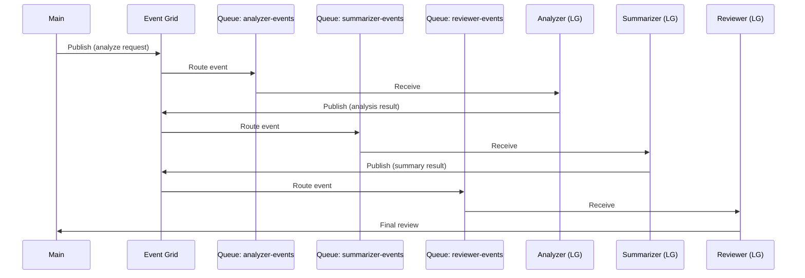

# LangGraph — Multi-Agent Event Grid Pipeline

## Overview

Demonstrates a **three-agent document analysis pipeline** built with
[LangGraph](https://github.com/langchain-ai/langgraph) where agents
communicate through **Azure Event Grid** (publish) and **Azure Storage Queues**
(subscribe/receive).

## Architecture



## Prerequisites

| Resource | Purpose |
|---|---|
| Azure OpenAI | LLM inference (gpt-4o) |
| Azure Event Grid | Event routing |
| Azure Storage Account | Storage Queues for subscriptions |

## Quick Start

```bash
uv venv --python 3.11 && source .venv/bin/activate
uv sync
uv run python src/main.py
```
