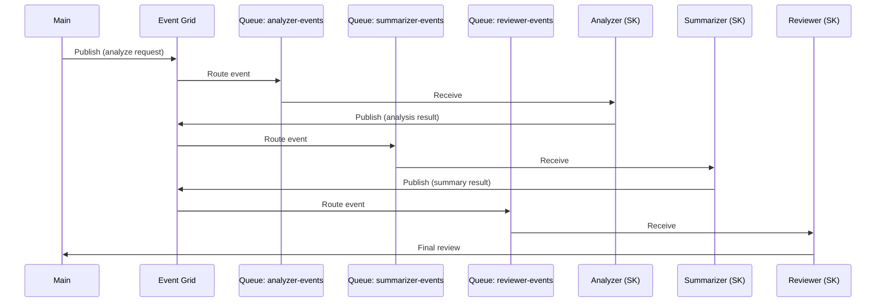

# Semantic Kernel — Multi-Agent Event Grid Pipeline

## Overview

Demonstrates a **three-agent document analysis pipeline** built with
[Semantic Kernel](https://github.com/microsoft/semantic-kernel) where agents
communicate through **Azure Event Grid** (publish) and **Azure Storage Queues**
(subscribe/receive).

```
Event Grid Topic
  ├─► Storage Queue (analyzer-events)  → Analyzer Agent
  ├─► Storage Queue (summarizer-events) → Summarizer Agent
  └─► Storage Queue (reviewer-events)  → Reviewer Agent
```

## Architecture



## Prerequisites

| Resource | Purpose |
|---|---|
| Azure OpenAI | LLM inference (gpt-4o) |
| Azure Event Grid | Event routing |
| Azure Storage Account | Storage Queues for subscriptions |

## Quick Start

```bash
# 1. Create virtual environment
uv venv --python 3.11 && source .venv/bin/activate

# 2. Install dependencies
uv sync

# 3. Set environment variables (see .env.example at project root)

# 4. Run
uv run python src/main.py
```

## Resiliency

- Events are delivered to durable Storage Queues — survives consumer downtime
- Failed events route to Dead Letter storage for inspection
- Retry policies configurable on Event Grid subscriptions
